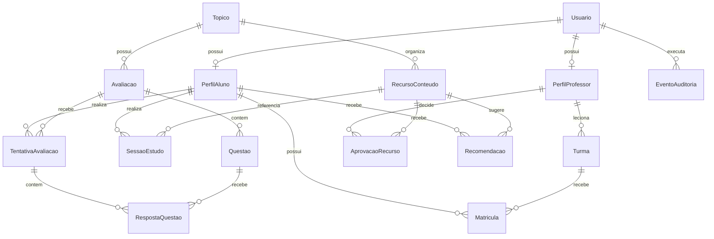

# Modelo de dados físico

## Diagrama de entidades

## Tabelas e finalidade

| Tabela | Finalidade | Chaves e restrições relevantes |
|---|---|---|
| `Usuario` | Identidade de demonstração e papel. | `nomeUsuario` único, `senhaHash` e um papel por usuário. |
| `PerfilAluno` | Dados acadêmicos mínimos do aluno. | `usuarioId` e `pseudonimo` únicos. |
| `PerfilProfessor` | Vínculo docente. | `usuarioId` único. |
| `Turma` | Agrupamento sob um professor. | combinação `nome + periodo` única. |
| `Matricula` | Vínculo aluno–turma. | combinação `alunoId + turmaId` única. |
| `Topico` | Unidade de análise pedagógica. | `identificador` único. |
| `RecursoConteudo` | Material disponível para estudo. | `identificador` único; indexado por tópico e formato. |
| `AprovacaoRecurso` | Curadoria do professor. | combinação `recursoId + professorId` única. |
| `SessaoEstudo` | Registro de estudo de material. | indexado por aluno, tópico e situação. |
| `Avaliacao` | Instrumento objetivo por tópico. | `identificador` único. |
| `Questao` | Item de avaliação. | posição única dentro da avaliação. |
| `TentativaAvaliacao` | Resultado do aluno em avaliação. | indexado por aluno, tópico e conclusão. |
| `RespostaQuestao` | Resposta e correção de um item. | uma resposta por questão em cada tentativa. |
| `Recomendacao` | Registro previsto de sugestões emitidas. | indexado por aluno, tópico e situação. |
| `EventoAuditoria` | Ação sensível rastreável. | indexado por ator e data. |

## Dados derivados versus dados brutos

Dados brutos: sessão, recurso, tentativa, questão, resposta e curadoria.

Dados derivados em memória no MVP: evidência, média por formato, tendência, nível de evidência e recomendação. A versão do algoritmo é `regras-base-v1`.

Ao implementar persistência de recomendações, gravar também: quantidade de evidências, nota comparada, versão do algoritmo, situação, data e expiração. Nunca persistir uma afirmação causal.

## Política de deleção

- Perfis de aluno/professor acompanham exclusão de usuário no banco demonstrativo.
- Conteúdo referenciado por sessão não deve ser excluído fisicamente em cenário com dados reais; preferir campo `ativo`.
- Recursos vinculados a recomendação usam referência anulável.
- Banco local atual é sintético e pode ser recriado com `npm run banco:reiniciar`.
