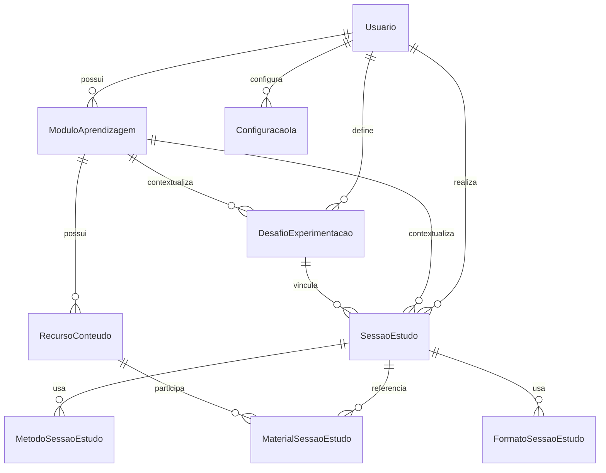

# Modelo de dados físico

> Estado definitivo da jornada por sessões em 2026-09-20. Tópicos, avaliações objetivas, questões, tentativas, respostas e recomendações antigas foram removidos do schema pela migração `20260920140000_remocao_topicos_avaliacoes`.

## Fundação de salas e compartilhamento

- `Sala` pertence ao `Usuario` proprietário e usa exclusão lógica.
- `MembroSala` representa proprietário ou membro e preserva o motivo de encerramento (`SAIU` ou `REMOVIDO`).
- `ConviteSala` guarda apenas o hash do código, expiração e revogação; `SolicitacaoEntradaSala` separa convite de aprovação.
- `ModuloSala` é um contexto-pai de agregação, limitado pela regra de serviço a cinco itens ativos por sala.
- `VinculoModuloSala` conecta um membro e seu `ModuloAprendizagem` pessoal ao módulo-pai. O módulo pessoal usa `onDelete: Restrict` e não é propriedade da sala.
- `permitirComparacao` e `permitirIa` são consentimentos independentes, falsos por padrão. `compartilharDashboard` é desligado ao encerrar o vínculo.
- `ComentarioSala` possui escopo `SALA`, `MODULO` ou `MEMBRO`; somente o serviço valida a combinação exata de alvos.
- `EvidenciaHistoricaModuloSala` preserva somente data, duração, percepções, métodos e formatos de uma sessão válida após o desligamento. A referência da sessão e do contribuinte é pseudonimizada por SHA-256 e não existe relação com usuário ou módulo pessoal.
- `VinculoModuloSala.dadosDesde` define o início da nova janela ao reativar um vínculo já preservado no histórico, evitando contagem duplicada.

Os dashboards são calculados sob demanda. Somente as evidências históricas mínimas são persistidas para que o desligamento não apague o agregado já formado nem reabra acesso individual.

## Diagrama de entidades

## Tabelas centrais

| Tabela | Finalidade | Restrições relevantes |
|---|---|---|
| `Usuario` | Conta pessoal sintética. | `nomeUsuario` único e senha armazenada como hash. |
| `ModuloAprendizagem` | Espaço principal de organização. | Pertence à conta; identificador único por conta; aceita rascunho e arquivamento. |
| `RecursoConteudo` | Material próprio do módulo. | Pertence diretamente ao módulo; origem `TEXTO`, `LINK` ou `ARQUIVO`; arquivamento lógico. |
| `ArquivoMaterial` | Metadados do binário validado. | Relação 1:1 com material; conteúdo físico fica fora de `public/`. |
| `AnaliseMaterial` | Resultado compacto da análise automática. | Relação 1:1; persiste resumo, conceitos, sugestões, origem, limites e estado, mas nunca o texto integral extraído. |
| `SessaoEstudo` | Registro central de estudo. | Pertence à conta e ao módulo; registra descrição, modo, período UTC, duração oficial, situação, arquivamento e percepções. |
| `MetodoSessaoEstudo` | Métodos da sessão. | Chave composta impede duplicidade e permite seleção múltipla. |
| `FormatoSessaoEstudo` | Formatos da sessão. | Chave composta impede duplicidade e permite seleção múltipla. |
| `MaterialSessaoEstudo` | Materiais opcionais usados na sessão. | Relação muitos-para-muitos entre sessão e material do mesmo módulo. |
| `DesafioExperimentacao` | Contexto pessoal para observar um método. | Pertence à conta e ao módulo; cancelamento preserva sessões anteriores. |
| `ConfiguracaoIa` | Credencial privada por provedor. | Única por conta/provedor; segredo cifrado por AES-256-GCM e nunca devolvido à interface. |

As tabelas de perfis, turmas e aprovações são estruturas históricas fora da jornada pessoal e não autorizam acesso baseado em papel.

## Dados e métricas

Dados brutos da jornada: módulo, material, sessão, métodos, formatos, percepções e desafio opcional.

O motor puro `metricas-sessoes-v1` calcula quantidade de sessões válidas, minutos totais, duração média, dias com estudo, sequência diária UTC, período, médias de percepção com amostra mínima, contextos por método e formato e evolução semanal. Não há nota, taxa de acerto, avaliação objetiva ou Bloom no modelo ativo.

Sessões planejadas, ativas e invalidadas não entram nos indicadores. Sessões arquivadas permanecem nas métricas para preservar o histórico estudado. Métodos e formatos múltiplos são contextos não exclusivos.

## Migração definitiva

A Fase 9 só removeu as colunas legadas depois que métodos, formatos, materiais, descrições, conta e módulo já estavam normalizados. A migração recria `RecursoConteudo` e `SessaoEstudo` preservando seus identificadores e dados válidos, remove as referências `topicoId`, `recursoId` e `metodo` e então exclui `Topico`, `Avaliacao`, `Questao`, `TentativaAvaliacao`, `RespostaQuestao` e `Recomendacao`.

O script de migração executa `PRAGMA foreign_key_check` após cada etapa. O cenário sintético e os verificadores também confirmam que as tabelas removidas não existem mais.

## Política de deleção

- Módulos, materiais e sessões usam arquivamento lógico nas jornadas normais.
- A exclusão permanente de material remove primeiro os vínculos opcionais com sessões, sem apagar as sessões, e então remove metadados, análise e binário.
- O banco local contém apenas dados sintéticos e pode ser recriado com `npm run banco:reiniciar`.
- Arquivos ficam em `.dados/arquivos-materiais`, fora do Git e de `public/`.
