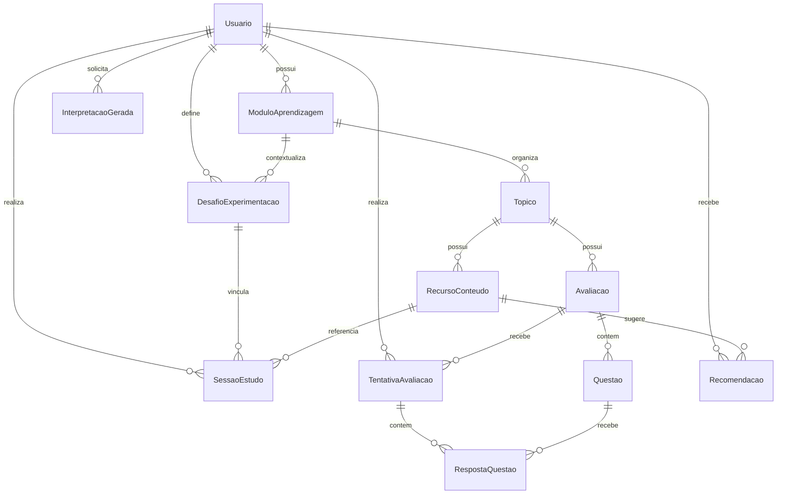

# Modelo de dados físico

> Estado de transição em 2026-09-12: a Fase 2 aplicou `ModuloAprendizagem`, propriedade direta e identificadores no escopo correto ao banco sintético. Perfis, turmas, curadoria e o campo físico legado de papel permanecem apenas para compatibilidade temporária da migração inicial; não representam recursos do produto nem podem ser usados por rotas, serviços ou interface.

## Diagrama de entidades

## Tabelas e finalidade

| Tabela | Finalidade | Chaves e restrições relevantes |
|---|---|---|
| `Usuario` | Conta pessoal sintética. | `nomeUsuario` único, `senhaHash` e dados mínimos de perfil; não possui papel do produto. |
| `ModuloAprendizagem` | Unidade principal de organização pessoal. | pertence a `Usuario`; identificador único no escopo da conta; permite arquivamento lógico; `rascunho` inicia em `false`. Quando `true`, é um registro ainda sem conteúdo (`titulo` e `descricao` vazios), acessível apenas à proprietária e excluído de Dashboard, métricas e interpretação. |
| `Topico` | Unidade de conteúdo dentro de módulo. | pertence a `ModuloAprendizagem`; identificador único no escopo do módulo; `rascunho` permite primeira configuração com nome e descrição vazios, sem materiais, avaliações ou métricas. |
| `RecursoConteudo` | Material próprio disponível para estudo. | pertence ao tópico; origem explícita `TEXTO`, `LINK` ou `ARQUIVO`; texto e link HTTP(S) são mutuamente exclusivos; `ativo` implementa arquivamento lógico. |
| `ArquivoMaterial` | Metadados de arquivo binário validado. | relação 1:1 com `RecursoConteudo`; guarda nome original, MIME, tamanho, extensão e chave opaca, nunca caminho físico ou conteúdo no SQLite. |
| `DesafioExperimentacao` | Proposta pessoal de observar um método em um módulo. | pertence a `Usuario` e `ModuloAprendizagem`; guarda método controlado, meta de 3 a 280 caracteres, situação `ATIVO` ou `CANCELADO` e data de cancelamento. Não é avaliação, recomendação nem indicador causal. |
| `SessaoEstudo` | Registro de estudo de material. | pertence diretamente a `Usuario`; registra método controlado, duração oficial, dificuldade e compreensão percebidas de 1 a 5 e observação de até 500 caracteres. `desafioId` é opcional, preserva sessões anteriores e só pode apontar para desafio ativo da mesma conta, módulo e método. |
| `Avaliacao` | Instrumento objetivo por tópico. | identificador único dentro do tópico. |
| `Questao` | Item de avaliação. | posição única dentro da avaliação; `nivelBloom` opcional é armazenável, mas suas análises pertencem à Entrega B. |
| `TentativaAvaliacao` | Resultado da conta pessoal em avaliação. | pertence diretamente a `Usuario`; indexado por conta, módulo, tópico e conclusão; `numeroTentativa` é único por conta e avaliação; não possui `sessaoId` na Entrega A. |
| `RespostaQuestao` | Resposta e correção de um item. | uma resposta por questão em cada tentativa. |
| `Recomendacao` | Registro previsto de sugestões oficiais emitidas. | indexado por conta, módulo, tópico e situação; inclui versão do algoritmo. |

## Dados derivados versus dados brutos

Dados brutos: módulo, tópico, recurso, desafio, sessão, tentativa, questão e resposta.

Dados derivados em memória nas Entregas A e B: evidência, média por módulo, tópico, método e formato, tendência, percepção versus resultado, nível de evidência, recomendação, evolução semanal da média das taxas por tópico, dificuldade atual estimada, comparação contextual de desafio e taxa por nível de Bloom. Cada algoritmo possui versão própria e não persiste inferência causal.

Um rascunho de `ModuloAprendizagem` não é uma evidência nem um módulo ativo: não aceita tópicos, materiais, sessões ou avaliações antes da primeira configuração. A migração `20260913130000_modulo_rascunho` acrescenta `rascunho BOOLEAN NOT NULL DEFAULT false`, preservando os módulos existentes como configurados.

Um rascunho de `Topico` também não é evidência: não aceita materiais, sessões ou avaliações até que a atualização válida grave nome, descrição, identificador definitivo e `rascunho: false`. A migração `20260913150000_topico_rascunho_arquivos_materiais` preserva tópicos e materiais existentes como configurados e classifica seus materiais preexistentes como texto ou link.

A migração `20260915100000_desafios_experimentacao_bloom` cria `DesafioExperimentacao` e acrescenta `SessaoEstudo.desafioId` anulável. Sessões existentes continuam sem desafio e os níveis de Bloom já persistidos passam a ter análise local quando houver respostas classificadas suficientes.

Ao implementar persistência de recomendações, gravar também: quantidade de evidências, nota comparada, versão do algoritmo, situação, data e expiração. Nunca persistir uma afirmação causal. Nesta Entrega A, a interpretação da Gemini é transitória e não é persistida; recebe DTO agregado sem nome, resposta, observação livre ou chave e não pode substituir nem alterar dados brutos ou métricas oficiais.

## Política de deleção

- A conta pessoal não possui perfis de aluno/professor no modelo-alvo; as estruturas legadas só poderão ser removidas após migração e conferência completas.
- Conteúdo referenciado por sessão não deve ser excluído fisicamente em cenário com dados reais; preferir campo `ativo`.
- Recursos vinculados a recomendação usam referência anulável.
- Banco local atual é sintético e pode ser recriado com `npm run banco:reiniciar`.
- Arquivos locais do protótipo ficam em `.dados/arquivos-materiais`, fora de `public/` e do controle de versão. O reset do cenário sintético remove somente esse diretório padrão junto ao banco; o conteúdo físico não é removido por arquivamento lógico.
- A migração de Fase 2 foi conferida tanto sobre uma cópia do cenário legado como sobre banco vazio; `PRAGMA foreign_key_check` não encontrou violações.
